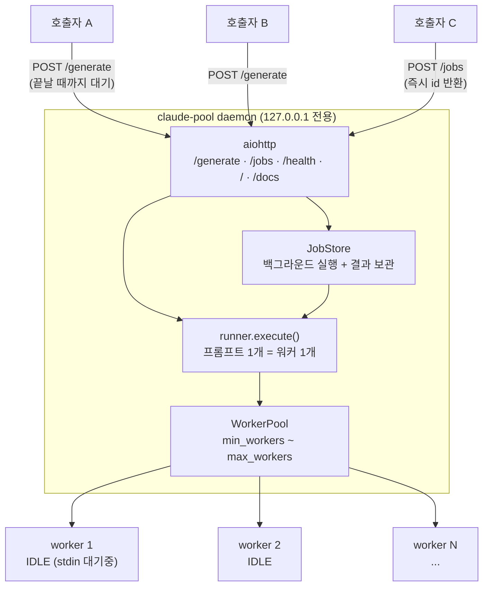
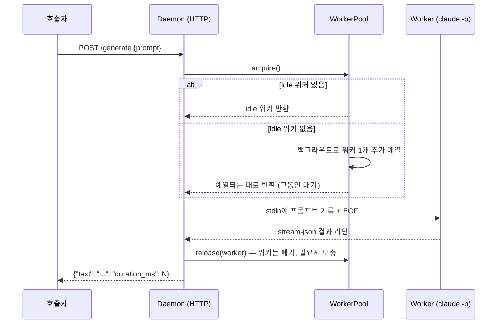
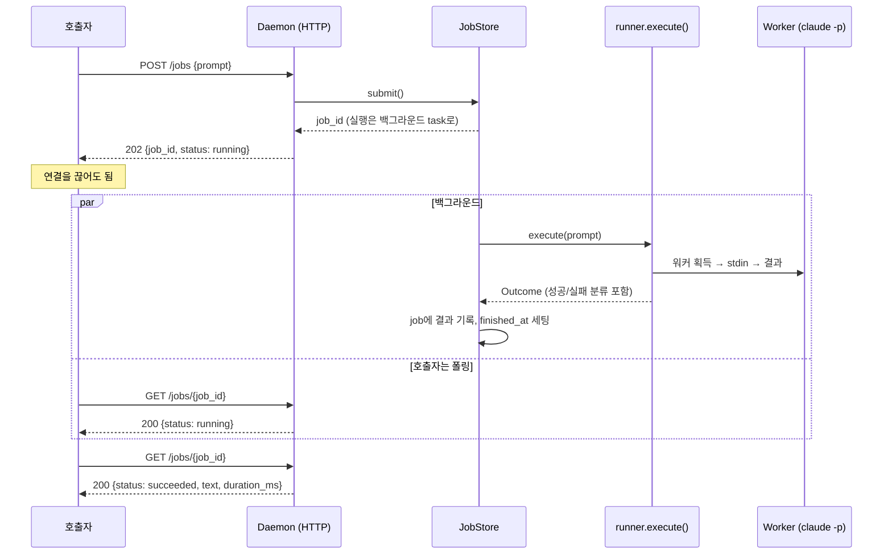

# claude-pool

Claude Code CLI(`claude`)를 로컬 LLM처럼 쓰기 위한 HTTP 게이트웨이입니다. `claude -p` 워커 프로세스를 미리 띄워놓고 대기시켜서, 매 요청마다 CLI 부팅 비용을 새로 치르지 않고도 여러 곳에서 동시에 호출할 수 있게 해줍니다.

## 빠른 시작

```bash
python scripts/daemon_ctl.py start      # 실행 (이미 떠 있으면 그대로 둠)
python scripts/daemon_ctl.py status     # 상태 확인
python scripts/daemon_ctl.py restart    # 재시작
python scripts/daemon_ctl.py stop       # 종료 (워커까지 함께 정리됨)
```

```
running  pid=109600  http://127.0.0.1:8756
  model    sonnet
  workers  4/4 idle alive, 0 busy  (min 4, max 30)
  jobs     0 running, 0 kept
  docs     http://127.0.0.1:8756/docs
```

**문서: <http://127.0.0.1:8756/docs>** — 데몬이 자기 사용법을 직접 서빙합니다 (브라우저용 HTML, `GET /`은 같은 내용의 JSON).

호출해 보기:

```bash
curl -s -X POST http://127.0.0.1:8756/generate   -H "Content-Type: application/json"   -d "{\"prompt\": \"reply with the single word PONG\"}"
```

설정은 환경변수로 바꾸며, `daemon_ctl.py`도 같은 환경변수를 읽습니다:

```bash
CLAUDE_POOL_MODEL=haiku CLAUDE_POOL_MIN_WORKERS=1 python scripts/daemon_ctl.py start
CLAUDE_POOL_PORT=8757 python scripts/daemon_ctl.py start    # 다른 모델용 데몬을 하나 더
```

> 워커는 **창 없이** 실행됩니다. 호출해도 터미널/CMD 창이 뜨지 않는 게 정상입니다 — 돌아가는지는 `status`나 `/health`의 `busy`로 확인하세요.

## 왜 만들었나

Claude Code 구독형 계정도 API 토큰처럼 코드에서 호출해서 쓰기 위해 만들었습니다. 별도 API 키 없이, 이미 인증된 구독 계정을 그대로 로컬 HTTP 엔드포인트로 노출해서 원하는 곳에서 프롬프트를 넣고 텍스트 응답을 받을 수 있게 합니다.

## 아키텍처

이 프로젝트의 아키텍처는 두 가지 목표를 위해 만들어졌습니다: **병렬 처리**(여러 곳에서 동시에 호출해도 감당할 수 있어야 함)와 **독립 테넌트**(요청 간에 컨텍스트가 섞이면 안 됨).

### 병렬 처리 — 워커 풀 + 오토스케일링



동기 호출과 백그라운드 job은 **입구만 다르고 워커를 쓰는 방식은 같습니다.** 둘 다 `runner.execute()` 하나로 모이는데, 워커를 반납(=폐기)하는 코드가 거기 한 곳에만 있기 때문입니다 — 취소된 호출자가 `claude` 프로세스를 고아로 남기지 못하게 막는 유일한 지점입니다.

`claude -p` 프로세스를 미리 여러 개 띄워놓고 대기시켜서(pre-warm), 요청이 오면 그중 하나에게 넘겨주는 방식입니다.

- 매 요청마다 새 프로세스를 부팅하는 비용 없이 여러 요청을 동시에 처리합니다.
- 요청이 몰려서 idle 워커가 바닥나면(`acquire()`에서 큐잉 발생) 자동으로 워커를 늘리고(`max_workers`까지), 한가해지면 일정 시간(`idle_timeout_sec`) 이상 안 쓰인 워커를 정리해서 `min_workers`까지 줄이는 오토스케일링이 있습니다.
- 취소된 요청, 스폰 실패, 데몬 종료 등 예외 상황에서도 워커 프로세스가 좀비로 남지 않도록 정리합니다.

### 독립 테넌트 — 1회용 워커 + stream-json (동기 경로)



각 워커는 딱 한 번의 요청만 처리하고 폐기됩니다. 다음 요청은 항상 새 워커가 받기 때문에 이전 요청의 대화 내용이 섞여 들어갈 수 없습니다.

워커는 `--input-format stream-json --output-format stream-json --verbose`로 실행됩니다 (`--input-format text`는 stdin 입력이 3초 안에 안 들어오면 에러를 내므로 사용하지 않음). stdin으로 `{"type":"user","message":{"role":"user","content":"<prompt>"}}` 형태의 JSON 한 줄을 받고, stdout의 stream-json 라인 중 `"type":"result"`인 라인에서 `is_error`/`result`/`duration_ms`를 추출합니다.

### 백그라운드 실행 — 연결을 붙잡지 않는 경로

`POST /generate`는 완성될 때까지 HTTP 연결을 붙잡습니다. 몇 분짜리 생성이면 호출하는 쪽이 그동안 소켓을 물고 있어야 합니다. `POST /jobs`는 같은 body를 받아 id만 즉시 돌려주고, `claude`는 백그라운드에서 돕니다.



- 조회는 **실패한 job도 200**입니다. 조회 자체는 성공했고 job의 결과는 body의 `status`에 있습니다 — 폴링하는 쪽이 상태 코드를 두 겹으로 해석할 필요가 없습니다.
- `DELETE /jobs/{id}`는 워커를 실제로 죽인 뒤에 응답합니다. 그러지 않으면 "취소됨"이 사실이 아니라 주장이 됩니다.
- 끝난 job은 `job_retention_sec` 동안만 보관하고 `max_jobs`로 개수를 제한합니다. **실행 중인 job은 절대 버리지 않습니다** — 결과가 갈 곳이 있어야 하니까요. 정리는 제출 시점에만 돌아서, 관리할 백그라운드 루프가 늘지 않습니다.
- 데몬이 종료되면 `JobStore.shutdown()`이 `WorkerPool.stop()`보다 **먼저** 실행됩니다. job을 취소해야 워커가 풀로 반납되고, 그래야 풀이 전부 정리할 수 있습니다.

### 자기 문서화

데몬은 자기 사용법을 직접 서빙합니다 (`GET /`, `GET /docs`, `GET /openapi.json`). 포트만 열려 있으면 README가 없어도 쓰는 법을 알 수 있어야 하기 때문입니다 — 이 게이트웨이의 실제 발견자는 대개 열린 포트 말고는 단서가 없는 스크립트나 에이전트입니다. 세 경로 모두 **실행 중인 데몬의 살아있는 설정**에서 생성되므로, haiku로 떠 있는 데몬이 sonnet이라고 답하는 일은 없습니다.

### 실패 분류

`claude` CLI는 레이트 리밋도, 만료된 로그인도, 모델 에러도 전부 같은 모양(`is_error: true`)으로 돌려줍니다. `errors.classify`가 이걸 `rate_limited` / `not_authenticated` / `worker_failed`로 나눠서 HTTP 상태와 `retryable`을 정합니다. **데몬은 자동 재시도하지 않습니다** — 재시도는 사용자의 구독 쿼터를 쓰는 행위라 호출자가 결정할 일입니다.

### 그 외

- **인증 없음, 로컬 전용**: `127.0.0.1`(loopback)에만 바인딩합니다 — `CLAUDE_POOL_HOST`를 loopback이 아닌 주소로 바꾸려 하면 시작 시점에 에러가 납니다. 여기에 더해 `Host` 헤더가 loopback 리터럴이 아닌 요청은 403으로 거절합니다: loopback 바인딩은 원격 TCP는 막지만 DNS rebinding은 못 막기 때문입니다(공격자가 소유한 호스트명을 127.0.0.1로 가리키면 브라우저 입장에서 same-origin이 되어, 페이지가 `/generate`를 호출해 구독 쿼터를 태울 수 있습니다). rebinding 요청은 반드시 공격자 호스트명을 `Host`에 싣고 오므로, 인증 계층 없이 이 한 겹으로 막힙니다.
- **워커는 창 없이(headless) 실행됨**: 데몬은 보통 자기 콘솔 없이 돌고(클라이언트가 `DETACHED_PROCESS`로 기동), **콘솔 없는 부모가 콘솔 앱을 스폰하면 Windows가 자식에게 새 콘솔을 할당합니다.** Windows 11에서는 그 콘솔을 기본 터미널 앱이 받아 실제 창으로 그리기 때문에, 그냥 두면 워커 스폰마다 터미널 창이 하나씩 뜹니다 — 워커는 1회용이라 요청 하나 처리할 때마다 보충 워커가 뜨므로, 호출할 때마다 창이 깜빡이게 됩니다. `CREATE_NO_WINDOW`로 막습니다(`worker.CREATION_FLAGS`). 워커의 stdio는 어차피 전부 데몬 파이프에 물려 있어서 그 콘솔은 애초에 아무것도 보여줄 수 없었습니다. 30ms 간격 창 폴러로 측정한 결과: 플래그 없으면 스폰당 창 1개(`WindowsTerminal.exe`, `CASCADIA_HOSTING_WINDOW_CLASS`), 있으면 0개. 창 없는 `conhost.exe`는 워커마다 여전히 생기지만 아무것도 그리지 않습니다.
- **모델은 데몬당 하나로 고정**: 예열 워커는 프로세스 시작 시점에 `--model`을 고정해서 뜨기 때문에, 요청별로 다른 모델을 요청하는 건 지원하지 않습니다. 다른 모델이 필요하면 다른 포트로 데몬을 하나 더 띄우면 됩니다.
- **데몬이 죽어도 워커는 고아로 안 남음**: 모든 워커는 Windows Job Object(`JOB_OBJECT_LIMIT_KILL_ON_JOB_CLOSE`)에 묶여 있습니다. 정상 종료(`Ctrl+C`, 취소)는 `WorkerPool.stop()`이 처리하고, 강제 종료·크래시처럼 정리 코드가 전혀 실행되지 않는 경우에도 OS가 job 핸들이 닫히는 즉시 워커 프로세스를 전부 종료시킵니다. 실제 데몬(워커 3개)을 `taskkill /F`로 강제 종료해서 확인한 결과, Python 코드 실행 없이 워커 3개 전부 즉시 종료되고 고아 프로세스가 남지 않았습니다.

## 시작하기

### 설치

```bash
git clone https://github.com/HojinJava/claude_code_cli_local_gateway.git
cd claude_code_cli_local_gateway
pip install -e ".[dev]"
```

Python 3.11 이상, 그리고 로컬에 인증된 `claude` CLI가 PATH에 있어야 합니다 (API 키 불필요 — 구독 인증을 그대로 사용).

### 데몬 실행

```bash
python scripts/daemon_ctl.py start   # detached로 기동 + 상태 출력 (권장)
python -m claude_pool.daemon         # 포그라운드로 직접 실행 (Ctrl+C로 종료)
```

`daemon_ctl.py`는 기동할 포트의 pid를 `<scratch_dir>/daemon-<port>.pid`에 기록하고, `stop`은 그 pid가 **정말 claude-pool 데몬인지 커맨드라인으로 확인한 뒤에만** 종료합니다. pid는 재사용되고 강제 종료는 파일을 지우지 못하고 남기기 때문입니다. pid 파일이 없는데 포트가 응답하면(구버전으로 띄웠거나 손으로 띄운 경우) 실행 중인 데몬이 정확히 하나일 때만 그걸 잡고, 여러 개면 어느 게 이 포트인지 알 수 없으므로 **거절하고 후보 pid를 알려줍니다** — 포트는 커맨드라인에 안 나타나기 때문입니다(환경변수에서 옴).

기본값은 `min_workers=4`, `max_workers=30`, `model=sonnet`, `127.0.0.1:8756`입니다. 환경변수로 바꿀 수 있습니다:

| 환경변수 | 기본값 | 설명 |
|---|---|---|
| `CLAUDE_POOL_MIN_WORKERS` | 4 | 항상 유지할 예열 워커 최소 개수 |
| `CLAUDE_POOL_MAX_WORKERS` | 30 | 오토스케일링 상한 |
| `CLAUDE_POOL_MODEL` | sonnet | 데몬당 고정 모델 (요청별 override 불가) |
| `CLAUDE_POOL_HOST` | 127.0.0.1 | loopback 주소만 허용 (그 외는 시작 시점 에러) |
| `CLAUDE_POOL_PORT` | 8756 | |
| `CLAUDE_POOL_TIMEOUT_SEC` | 120.0 | 요청 하나당 기본 타임아웃 |
| `CLAUDE_POOL_ACQUIRE_TIMEOUT_SEC` | 60.0 | 워커를 못 구했을 때 최대 대기 시간 |
| `CLAUDE_POOL_IDLE_TIMEOUT_SEC` | 60.0 | 이 시간 이상 안 쓰인 idle 워커 정리 |
| `CLAUDE_POOL_SCALE_DOWN_INTERVAL_SEC` | 30.0 | 스케일다운 점검 주기 |
| `CLAUDE_POOL_JOB_RETENTION_SEC` | 600.0 | 끝난 백그라운드 job을 읽을 수 있는 시간 |
| `CLAUDE_POOL_MAX_JOBS` | 500 | 보관 job 수 상한 (실행 중인 건 안 버림) |
| `CLAUDE_POOL_SCRATCH_DIR` | `~/.claude-pool/scratch` | 워커의 작업 디렉터리(cwd). 자동으로 비우지 않습니다 |
| `CLAUDE_POOL_CLAUDE_CMD_JSON` | `["claude"]` | 워커 실행 명령. 문자열 JSON 배열이어야 하며, 아니면 시작 시점에 에러 |

### 워커 사이징 (`min_workers`/`max_workers` 정하는 법)

예열 워커는 대기하는 동안에도 메모리와 CPU를 씁니다. 둘 다 실측 기준으로 잡아야 합니다.

**메모리** (idle 상태로 stdin 대기 중, haiku 모델, 워커 4개 동시 실행 기준)

| 상태 | Working Set(실 상주 메모리) | Private(커밋) |
|---|---|---|
| idle (대기 중) | 약 236MB/개 | 약 380MB/개 |
| 실제 요청 처리 중(peak) | idle 대비 +3~5% | idle 대비 +3~5% |

측정 방식은 워커 4개를 띄우고 8초간 부팅이 안정된 뒤 각 프로세스의 `WorkingSet64`/`PrivateMemorySize64`를 합산한 값입니다. 워커는 자식 프로세스를 만들지 않으므로 프로세스 1개 = 워커 1개입니다. CLI 버전과 모델에 따라 편차가 있으니, 실제 사이징 전에 본인 환경에서 한 번 재보는 걸 권합니다.

**CPU** — idle 워커는 공짜가 아닙니다.

| 구간 | 실측 |
|---|---|
| 부팅(스폰 ~ stdin 대기 진입) | 약 1.1초 동안 CPU 1.47초 소모 |
| 그 이후 idle 상태 유지 | **코어 하나의 약 2.5%를 계속 사용** (11.8초 동안 CPU 0.30초) |

즉 `max_workers=30`까지 늘어난 상태를 계속 유지하면 **상시 코어 약 0.75개 + 메모리 약 7~11GB**를 점유합니다. `min_workers`는 이 상시 비용을 그대로 지불하겠다는 선언이므로 보수적으로 잡아야 합니다.

**적정량 계산**: `(여유 RAM − OS/다른 프로그램용 여유분 2~4GB) ÷ 워커당 약 380MB`, 그리고 `min_workers × 0.025` 코어가 상시로 나가도 괜찮은지 함께 확인.

예) 32GB RAM, 여유 RAM ≈ 28GB 기준: `(28 − 3) / 0.38` ≈ **약 65개**가 메모리 상한입니다. 여기에 CPU 여유까지 감안해서 `min_workers`는 훨씬 작게(기본 4 수준), `max_workers`는 버스트 상한으로 잡으세요.

### 예열이 실제로 아끼는 시간

`claude -p`는 stdin을 받기 전에 부팅을 끝내고 대기합니다 — 위 표의 **CPU 1.47초 / 벽시계 약 1.1초**가 그것이고, 예열 풀이 요청 경로에서 걷어내는 게 정확히 이 구간입니다.

나머지 구간 실측:

| 구간 | 실측 |
|---|---|
| HTTP loopback 왕복 | <1ms |
| 워커 프로세스 spawn (`create_subprocess_exec`) | 약 12ms (이벤트 루프 stall 14ms) |
| 응답 후 `release()` (kill + 보충 스폰) | 약 5ms |
| LLM 추론 + Anthropic 왕복 | 수 초 |

프로세스 스폰·IPC 계층은 이미 무시할 수 있는 수준이고, 남은 지연은 사실상 전부 모델 추론입니다. `claude` CLI를 다른 IPC로 갈아끼워도 여기서 더 줄어들 게 없습니다 — 프로세스 자체가 독립 테넌트의 격리 경계이기 때문에, 프로세스를 재사용하는 어떤 IPC 설계도 이 프로젝트의 핵심 요구사항을 깹니다.

### Python에서 호출하기

```python
from claude_pool.client import ClaudePoolClient

client = ClaudePoolClient()  # 데몬이 안 떠 있으면 자동으로 띄움
text = client.generate("reply with the single word PONG")
print(text)  # "PONG"

print(client.health())
# {"min_workers": 4, "max_workers": 30, "total": 4, "idle": 4,
#  "idle_alive": 4, "busy": 0, "healthy": True,
#  "jobs": {"total": 0, "running": 0},
#  "last_spawn_error": None, "last_error": None}
```

실패는 `ClaudePoolError`로 올라오고, 재시도해도 되는지 여부를 함께 들고 옵니다:

```python
from claude_pool.client import ClaudePoolClient, ClaudePoolError

try:
    text = client.generate("...")
except ClaudePoolError as exc:
    print(exc.kind)             # "rate_limited" | "not_authenticated" | ...
    print(exc.retryable)        # True면 그대로 다시 보내도 되는 요청
    print(exc.retry_after_sec)  # 언제 다시 보낼지 (모를 땐 None)
```

### 실패를 어떻게 알려주나

`claude` CLI는 레이트 리밋도, 만료된 로그인도, 모델 자체 에러도 전부 똑같은 모양(`is_error: true`)으로 돌려줍니다. 데몬은 그 메시지를 분류해서 호출자가 행동을 결정할 수 있게 만듭니다.

| 상황 | HTTP | `kind` | `retryable` |
|---|---|---|---|
| 워커를 못 구함 (큐 적체) | 503 | `pool_unavailable` | ✅ |
| 레이트 리밋 / 사용량 한도 / overloaded | 429 (+ `Retry-After`) | `rate_limited` | ✅ |
| 타임아웃 | 504 | `timeout` | ✅ |
| CLI 로그인 만료 / 크레딧 부족 | 503 | `not_authenticated` | ❌ (사람이 재인증해야 함) |
| 그 외 워커 실패 | 502 | `worker_failed` | ❌ |
| Host 헤더가 loopback이 아님 | 403 | `forbidden_host` | ❌ |

분류는 CLI가 내보낸 사람이 읽는 메시지의 문자열 매칭이라 best-effort입니다. 못 알아본 실패는 `worker_failed`(502)로 떨어지며, 데몬이 **자동으로 재시도하지는 않습니다** — 재시도는 구독 쿼터를 쓰는 행위라 호출자가 결정할 일입니다.

가장 최근 실패 이유는 `/health`의 `last_error`에 남습니다. `idle`은 단순 카운터이고 `idle_alive`가 실제 살아있는 워커 수라서, 두 값이 벌어지면 예열해둔 `claude` 프로세스가 스스로 죽고 있다는 뜻입니다(로그아웃, 쿼터 소진 등).

### curl로 직접 호출

```bash
curl -X POST http://127.0.0.1:8756/generate \
  -H "Content-Type: application/json" \
  -d "{\"prompt\": \"reply with the single word PONG\"}"
```

### 백그라운드 실행 (긴 생성에 연결을 붙잡고 있지 않기)

`POST /generate`는 완성될 때까지 HTTP 연결을 붙잡고 있습니다. 몇 분짜리 생성이면 그동안 소켓을 물고 있어야 하고, 호출하는 쪽(스크립트, 셸을 막으면 안 되는 에이전트)이 곤란해집니다.

같은 body를 `POST /jobs`로 보내면 **즉시 job id를 받고 CLI는 백그라운드에서 돕니다.** 워커 수명주기는 완전히 동일합니다 — 프롬프트 하나에 워커 하나, 끝나면 폐기. 누가 기다리느냐만 다릅니다.

```bash
curl -s -X POST http://127.0.0.1:8756/jobs   -H "Content-Type: application/json" -d '{"prompt": "..."}'
# -> 202 {"job_id": "gi2DiEp1JsBEInKq", "status": "running", "url": "/jobs/gi2..."}

curl -s http://127.0.0.1:8756/jobs/gi2DiEp1JsBEInKq
# -> {"status": "succeeded", "text": "...", "duration_ms": 1176}
```

| 경로 | 설명 |
|---|---|
| `POST /jobs` | 제출. 202 + `job_id` 즉시 반환 |
| `GET /jobs/{job_id}` | 폴링. **항상 200** — 실패한 job도 200이고 `status`로 판단한다 (조회 자체는 성공했으므로) |
| `GET /jobs` | 목록, 최신순 |
| `DELETE /jobs/{job_id}` | 실행 중인 job 취소(워커까지 죽임) 또는 끝난 job 삭제 |

`status`는 `running` / `succeeded` / `failed` / `cancelled`. `failed`인 경우 동기 호출과 동일한 `error`/`kind`/`retryable`/`retry_after_sec`가 들어 있습니다.

Python:

```python
client = ClaudePoolClient()

job_id = client.submit("...")        # 즉시 반환
text = client.wait(job_id)           # 끝날 때까지 폴링, 실패하면 ClaudePoolError

# 배치로 던져놓고 나중에 걷기
ids = [client.submit(p) for p in prompts]
results = [client.wait(i) for i in ids]
```

끝난 job은 `CLAUDE_POOL_JOB_RETENTION_SEC`(기본 600초) 동안만 보관되고, 저장된 job 수는 `CLAUDE_POOL_MAX_JOBS`(기본 500)로 제한됩니다 — 결과를 안 걷어가는 호출자가 있어도 메모리가 무한히 늘지 않게. **실행 중인 job은 절대 버려지지 않습니다.** 데몬이 종료되면 실행 중인 job은 전부 취소되고 워커도 함께 정리됩니다.


### 데몬이 스스로 제공하는 문서

포트만 열려 있으면 README 없이도 쓰는 법을 알 수 있게, 데몬이 자기 문서를 서빙합니다. 세 경로 모두 **실행 중인 데몬의 실제 설정**(모델, 워커 수, 타임아웃)을 반영합니다 — 기본값이 아니라.

| 경로 | 내용 |
|---|---|
| `GET /` | JSON 자기소개. 엔드포인트·예제·실패 종류·제약·현재 설정. 프로그램이 읽기 좋은 형태 |
| `GET /docs` | 같은 내용을 브라우저용 HTML로. **CDN 의존 없이 자체 완결**이라 오프라인에서도 뜸 |
| `GET /openapi.json` | OpenAPI 3.1 스펙 |

```bash
curl -s http://127.0.0.1:8756/          # 이것만 보면 사용법이 다 나옴
start http://127.0.0.1:8756/docs        # 브라우저로 열기
```


## 테스트

전체 자동화 테스트는 실제 `claude` CLI를 호출하지 않고, `tests/fixtures/fake_claude_cli.py`(stream-json 프로토콜을 흉내내는 작은 파이썬 스크립트)를 상대로 돕니다. 비용 없이 빠르게 돌아갑니다.

```bash
pip install -e ".[dev]"
pytest -v
```

실제 `claude` CLI를 대상으로 한 수동 스모크 테스트(비용 발생, 자동화 안 됨)는 데몬을 직접 띄우고 확인합니다:

```bash
python -m claude_pool.daemon &

curl http://127.0.0.1:8756/health

curl -X POST http://127.0.0.1:8756/generate \
  -H "Content-Type: application/json" \
  -d "{\"prompt\": \"reply with the single word PONG\"}"
```
