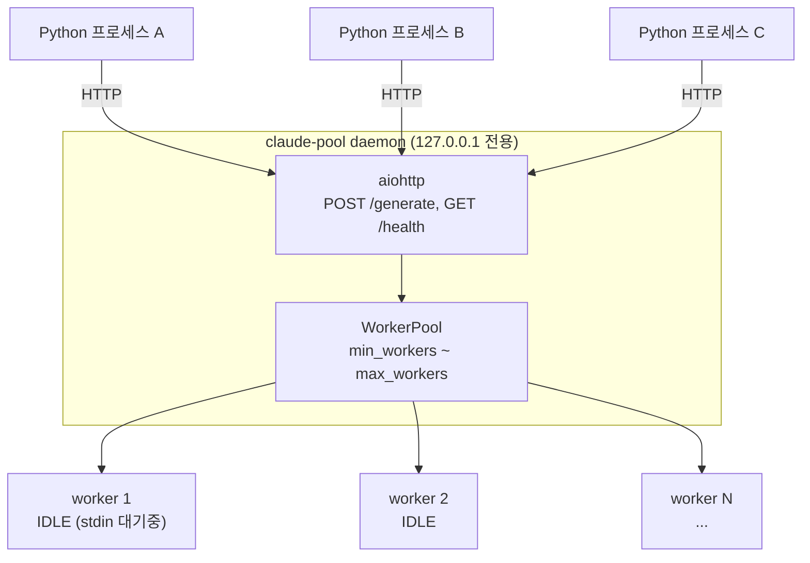
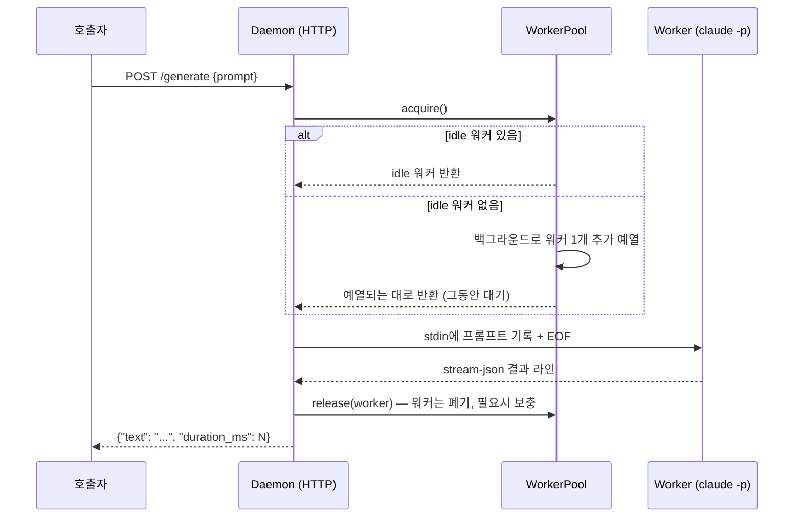

# claude-pool

Claude Code CLI(`claude`)를 로컬 LLM처럼 쓰기 위한 HTTP 게이트웨이입니다. `claude -p` 워커 프로세스를 미리 띄워놓고 대기시켜서, 매 요청마다 CLI 부팅 비용을 새로 치르지 않고도 여러 곳에서 동시에 호출할 수 있게 해줍니다.

## 왜 필요한가

Claude Code CLI를 코드에서 그냥 매번 새 프로세스로 실행하면:

- 매 호출마다 인증/초기화 부팅 비용을 다시 치른다
- 여러 곳에서 동시에 호출하면 감당하기 어렵다
- 세션이 이어지면 이전 요청 내용이 다음 응답에 섞여 들어갈 위험이 있다

`claude-pool`은 워커 프로세스를 미리 예열해서 대기시켜놓고(pre-warm), 요청이 오면 그중 하나에게 프롬프트를 흘려보내는 방식으로 이 문제를 해결합니다. 워커는 요청을 하나 처리하면 그걸로 끝 — 다음 요청은 항상 새 워커가 받으므로 세션이 섞일 일이 없습니다.

## 아키텍처



### 요청 처리 흐름



### 핵심 동작

- **1회용 워커**: 워커는 요청 하나만 처리하고 사라집니다. 다음 요청은 항상 새 워커가 받으므로 이전 대화 내용이 섞이지 않습니다 (독립 테넌트).
- **예열(pre-warm)**: 데몬은 `min_workers`개의 워커를 항상 미리 띄워서 stdin이 열린 채 대기시켜 놓습니다. 요청이 오면 이미 부팅이 끝난 워커에게 프롬프트만 흘려보내면 되므로 체감 지연이 거의 없습니다.
- **stream-json 프로토콜**: `claude -p --input-format text`는 stdin 데이터가 약 3초 안에 안 들어오면 포기하고 에러를 내는데, 이러면 워커를 미리 띄워놓고 나중에 먹이는 예열 풀의 전제가 깨집니다. 그래서 워커는 `--input-format stream-json --output-format stream-json --verbose`로 띄우며, 이 모드는 그런 타임아웃이 없다는 걸 실제 CLI로 검증했습니다 (`docs/superpowers/plans/2026-07-28-stream-json-investigation.md`).
- **오토스케일링**: 요청이 몰려서 idle 워커가 바닥나면(`acquire()`에서 큐잉 발생) 자동으로 워커를 늘리고(`max_workers`까지), 한가해지면 일정 시간(`idle_timeout_sec`) 이상 안 쓰인 워커를 정리해서 `min_workers`까지 줄입니다.
- **인증 없음, 로컬 전용**: `127.0.0.1`(loopback)에만 바인딩합니다 — `CLAUDE_POOL_HOST`를 loopback이 아닌 주소로 바꾸려 하면 시작 시점에 에러가 납니다. 별도 API 키 없이 로컬에 이미 인증된 Claude Code 구독 계정을 그대로 씁니다.
- **모델은 데몬당 하나로 고정**: 예열 워커는 프로세스 시작 시점에 `--model`을 고정해서 뜨기 때문에, 요청별로 다른 모델을 요청하는 건 지원하지 않습니다. 다른 모델이 필요하면 다른 포트로 데몬을 하나 더 띄우면 됩니다.

## 시작하기

### 설치

```bash
git clone https://github.com/HojinJava/claude_code_cli_local_gateway.git
cd claude_code_cli_local_gateway
pip install -e ".[dev]"
```

Python 3.11 이상, 그리고 로컬에 인증된 `claude` CLI가 PATH에 있어야 합니다 (API 키 불필요 — 구독 인증을 그대로 사용).

### 데몬 실행

```bash
python -m claude_pool.daemon
```

기본값은 `min_workers=4`, `max_workers=30`, `model=sonnet`, `127.0.0.1:8756`입니다. 환경변수로 바꿀 수 있습니다:

| 환경변수 | 기본값 | 설명 |
|---|---|---|
| `CLAUDE_POOL_MIN_WORKERS` | 4 | 항상 유지할 예열 워커 최소 개수 |
| `CLAUDE_POOL_MAX_WORKERS` | 30 | 오토스케일링 상한 |
| `CLAUDE_POOL_MODEL` | sonnet | 데몬당 고정 모델 (요청별 override 불가) |
| `CLAUDE_POOL_HOST` | 127.0.0.1 | loopback 주소만 허용 (그 외는 시작 시점 에러) |
| `CLAUDE_POOL_PORT` | 8756 | |
| `CLAUDE_POOL_TIMEOUT_SEC` | 120.0 | 요청 하나당 기본 타임아웃 |
| `CLAUDE_POOL_ACQUIRE_TIMEOUT_SEC` | 60.0 | 워커를 못 구했을 때 최대 대기 시간 |
| `CLAUDE_POOL_IDLE_TIMEOUT_SEC` | 60.0 | 이 시간 이상 안 쓰인 idle 워커 정리 |
| `CLAUDE_POOL_SCALE_DOWN_INTERVAL_SEC` | 30.0 | 스케일다운 점검 주기 |

### Python에서 호출하기

```python
from claude_pool.client import ClaudePoolClient

client = ClaudePoolClient()  # 데몬이 안 떠 있으면 자동으로 띄움
text = client.generate("reply with the single word PONG")
print(text)  # "PONG"

print(client.health())
# {"min_workers": 4, "max_workers": 30, "total": 4, "idle": 4, "busy": 0}
```

### curl로 직접 호출

```bash
curl -X POST http://127.0.0.1:8756/generate \
  -H "Content-Type: application/json" \
  -d "{\"prompt\": \"reply with the single word PONG\"}"
```

## 테스트

전체 자동화 테스트는 실제 `claude` CLI를 호출하지 않고, `tests/fixtures/fake_claude_cli.py`(stream-json 프로토콜을 흉내내는 작은 파이썬 스크립트)를 상대로 돕니다. 비용 없이 빠르게 돌아갑니다.

```bash
pip install -e ".[dev]"
pytest -v
```

실제 `claude` CLI를 대상으로 한 수동 스모크 테스트(비용 발생, 자동화 안 됨)는 데몬을 직접 띄우고 확인합니다:

```bash
python -m claude_pool.daemon &

curl http://127.0.0.1:8756/health

curl -X POST http://127.0.0.1:8756/generate \
  -H "Content-Type: application/json" \
  -d "{\"prompt\": \"reply with the single word PONG\"}"
```

## 설계 문서

이 프로젝트의 설계 배경, 검토했던 대안들, 구현 과정에서 발견하고 수정한 이슈들(예: `claude -p`의 stdin 3초 타임아웃 발견과 수정)은 `docs/superpowers/specs/`와 `docs/superpowers/plans/`에 자세히 남겨져 있습니다.
