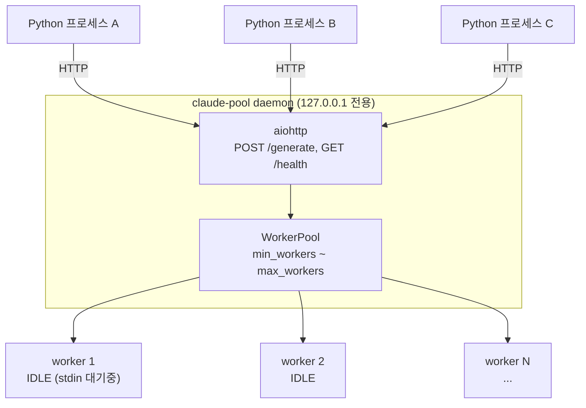
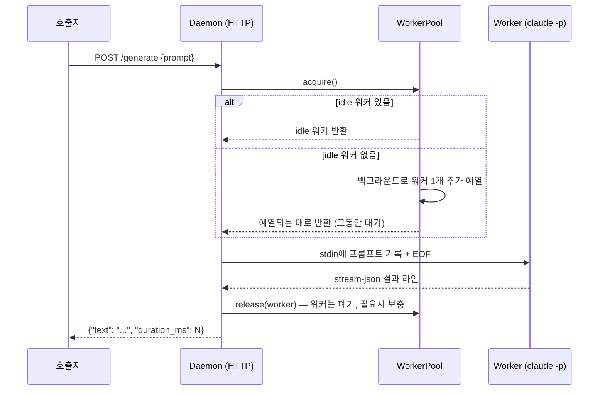

# claude-pool

Claude Code CLI(`claude`)를 로컬 LLM처럼 쓰기 위한 HTTP 게이트웨이입니다. `claude -p` 워커 프로세스를 미리 띄워놓고 대기시켜서, 매 요청마다 CLI 부팅 비용을 새로 치르지 않고도 여러 곳에서 동시에 호출할 수 있게 해줍니다.

## 왜 만들었나

Claude Code 구독형 계정도 API 토큰처럼 코드에서 호출해서 쓰기 위해 만들었습니다. 별도 API 키 없이, 이미 인증된 구독 계정을 그대로 로컬 HTTP 엔드포인트로 노출해서 원하는 곳에서 프롬프트를 넣고 텍스트 응답을 받을 수 있게 합니다.

## 아키텍처

이 프로젝트의 아키텍처는 두 가지 목표를 위해 만들어졌습니다: **병렬 처리**(여러 곳에서 동시에 호출해도 감당할 수 있어야 함)와 **독립 테넌트**(요청 간에 컨텍스트가 섞이면 안 됨).

### 병렬 처리 — 워커 풀 + 오토스케일링



`claude -p` 프로세스를 미리 여러 개 띄워놓고 대기시켜서(pre-warm), 요청이 오면 그중 하나에게 넘겨주는 방식입니다.

- 매 요청마다 새 프로세스를 부팅하는 비용 없이 여러 요청을 동시에 처리합니다.
- 요청이 몰려서 idle 워커가 바닥나면(`acquire()`에서 큐잉 발생) 자동으로 워커를 늘리고(`max_workers`까지), 한가해지면 일정 시간(`idle_timeout_sec`) 이상 안 쓰인 워커를 정리해서 `min_workers`까지 줄이는 오토스케일링이 있습니다.
- 취소된 요청, 스폰 실패, 데몬 종료 등 예외 상황에서도 워커 프로세스가 좀비로 남지 않도록 정리합니다.

### 독립 테넌트 — 1회용 워커 + stream-json



각 워커는 딱 한 번의 요청만 처리하고 폐기됩니다. 다음 요청은 항상 새 워커가 받기 때문에 이전 요청의 대화 내용이 섞여 들어갈 수 없습니다.

워커는 `--input-format stream-json --output-format stream-json --verbose`로 실행됩니다 (`--input-format text`는 stdin 입력이 3초 안에 안 들어오면 에러를 내므로 사용하지 않음). stdin으로 `{"type":"user","message":{"role":"user","content":"<prompt>"}}` 형태의 JSON 한 줄을 받고, stdout의 stream-json 라인 중 `"type":"result"`인 라인에서 `is_error`/`result`/`duration_ms`를 추출합니다.

### 그 외

- **인증 없음, 로컬 전용**: `127.0.0.1`(loopback)에만 바인딩합니다 — `CLAUDE_POOL_HOST`를 loopback이 아닌 주소로 바꾸려 하면 시작 시점에 에러가 납니다.
- **모델은 데몬당 하나로 고정**: 예열 워커는 프로세스 시작 시점에 `--model`을 고정해서 뜨기 때문에, 요청별로 다른 모델을 요청하는 건 지원하지 않습니다. 다른 모델이 필요하면 다른 포트로 데몬을 하나 더 띄우면 됩니다.

## 시작하기

### 설치

```bash
git clone https://github.com/HojinJava/claude_code_cli_local_gateway.git
cd claude_code_cli_local_gateway
pip install -e ".[dev]"
```

Python 3.11 이상, 그리고 로컬에 인증된 `claude` CLI가 PATH에 있어야 합니다 (API 키 불필요 — 구독 인증을 그대로 사용).

### 데몬 실행

```bash
python -m claude_pool.daemon
```

기본값은 `min_workers=4`, `max_workers=30`, `model=sonnet`, `127.0.0.1:8756`입니다. 환경변수로 바꿀 수 있습니다:

| 환경변수 | 기본값 | 설명 |
|---|---|---|
| `CLAUDE_POOL_MIN_WORKERS` | 4 | 항상 유지할 예열 워커 최소 개수 |
| `CLAUDE_POOL_MAX_WORKERS` | 30 | 오토스케일링 상한 |
| `CLAUDE_POOL_MODEL` | sonnet | 데몬당 고정 모델 (요청별 override 불가) |
| `CLAUDE_POOL_HOST` | 127.0.0.1 | loopback 주소만 허용 (그 외는 시작 시점 에러) |
| `CLAUDE_POOL_PORT` | 8756 | |
| `CLAUDE_POOL_TIMEOUT_SEC` | 120.0 | 요청 하나당 기본 타임아웃 |
| `CLAUDE_POOL_ACQUIRE_TIMEOUT_SEC` | 60.0 | 워커를 못 구했을 때 최대 대기 시간 |
| `CLAUDE_POOL_IDLE_TIMEOUT_SEC` | 60.0 | 이 시간 이상 안 쓰인 idle 워커 정리 |
| `CLAUDE_POOL_SCALE_DOWN_INTERVAL_SEC` | 30.0 | 스케일다운 점검 주기 |

### 메모리 사이징 (`min_workers`/`max_workers` 정하는 법)

워커 하나(idle 상태로 stdin 대기 중, haiku 모델 기준)가 쓰는 실측 메모리:

| 상태 | Working Set(실 상주 메모리) | Private(커밋) |
|---|---|---|
| idle (대기 중) | 약 360MB/개 | 약 425~440MB/개 |
| 실제 요청 처리 중(peak) | 약 370MB/개 (+10~16MB) | 약 437MB/개 |

idle 대비 처리 중 메모리 증가는 3~5% 수준입니다. 8개 동시 실행 시 실측 순증가는 워커당 약 180MB입니다 (여유 메모리 총 감소량 ÷ 워커 수).

**적정량 계산**: `(여유 RAM − OS/다른 프로그램용 여유분 2~4GB) ÷ 워커당 200~400MB`

예) 32GB RAM, 다른 프로그램 없이 새로 부팅한 상태(여유 RAM ≈ 28GB) 기준:
- 보수적으로(워커당 360MB): `(28 − 3) / 0.36` ≈ **약 70개**
- 실측 증가분 기준(워커당 180MB): `(28 − 3) / 0.18` ≈ **약 140개**

`min_workers`는 상시 대기시킬 최소 개수(항상 이만큼 메모리를 점유)로, `max_workers`는 버스트 시 늘어날 수 있는 상한으로 넉넉히 잡고 위 계산값보다 낮게 설정하는 걸 추천합니다. 다른 프로그램/다른 Claude Code 세션이 이미 메모리를 쓰고 있다면 그만큼 빼고 계산해야 합니다.

### Python에서 호출하기

```python
from claude_pool.client import ClaudePoolClient

client = ClaudePoolClient()  # 데몬이 안 떠 있으면 자동으로 띄움
text = client.generate("reply with the single word PONG")
print(text)  # "PONG"

print(client.health())
# {"min_workers": 4, "max_workers": 30, "total": 4, "idle": 4, "busy": 0}
```

### curl로 직접 호출

```bash
curl -X POST http://127.0.0.1:8756/generate \
  -H "Content-Type: application/json" \
  -d "{\"prompt\": \"reply with the single word PONG\"}"
```

## 테스트

전체 자동화 테스트는 실제 `claude` CLI를 호출하지 않고, `tests/fixtures/fake_claude_cli.py`(stream-json 프로토콜을 흉내내는 작은 파이썬 스크립트)를 상대로 돕니다. 비용 없이 빠르게 돌아갑니다.

```bash
pip install -e ".[dev]"
pytest -v
```

실제 `claude` CLI를 대상으로 한 수동 스모크 테스트(비용 발생, 자동화 안 됨)는 데몬을 직접 띄우고 확인합니다:

```bash
python -m claude_pool.daemon &

curl http://127.0.0.1:8756/health

curl -X POST http://127.0.0.1:8756/generate \
  -H "Content-Type: application/json" \
  -d "{\"prompt\": \"reply with the single word PONG\"}"
```
