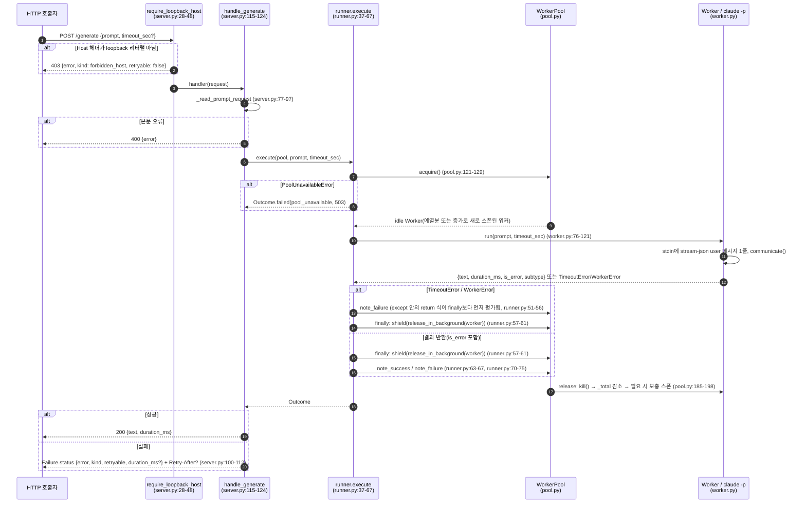

# 00. 개요 (as-built)

`claude-pool`은 로그인된 `claude` CLI를 로컬 HTTP 엔드포인트로 노출하는 aiohttp 데몬과, 이를 호출·기동하는 stdlib 전용 Python 클라이언트, 운영·조사 스크립트로 구성된 단일 Python 패키지다. 이 문서는 실제 진입점과 실행 경로를 요약하고 상세는 각 주제 문서로 연결한다.

## 시스템 경계 요약

- 데몬 프로세스 1개가 `PoolConfig.host:port`(기본 `127.0.0.1:8756`)에 바인딩하고(`src/claude_pool/daemon.py:36`), 요청마다 1회용 `claude -p` 자식 프로세스(워커)를 풀에서 꺼내 사용한다(`src/claude_pool/runner.py:37-67`).
- 상태는 모두 데몬 프로세스 메모리에 있다(`WorkerPool` 내부 상태 `src/claude_pool/pool.py:19-38`, `JobStore._jobs` `src/claude_pool/jobs.py:86`). 디스크에 쓰는 것은 pid 파일 하나다(`src/claude_pool/daemon.py:38`).
- DB·캐시·큐·외부 HTTP 호출 코드는 없다. 외부 실행 의존은 `claude` CLI 프로세스뿐이다 → [08-system-context](08-system-context.md).

## 실제 진입점

| 진입점 | 위치 | 실행 경로 |
|---|---|---|
| 콘솔 스크립트 `claude-pool-daemon` | `pyproject.toml:17-18` | `claude_pool.daemon:main` |
| `python -m claude_pool.daemon` | `src/claude_pool/daemon.py:70-71` | `main()` → `PoolConfig.from_env()` → `asyncio.run(run_daemon(config))` (`daemon.py:65-67`) |
| 클라이언트 자동 기동 | `src/claude_pool/client.py:46-48`, `client.py:74` | `[sys.executable, "-m", "claude_pool.daemon"]`을 detached로 `Popen` |
| `python scripts/daemon_ctl.py start\|stop\|restart\|status` | `scripts/daemon_ctl.py:178-187` | `start`는 클라이언트 자동 기동 경로를 재사용(`daemon_ctl.py:125-129`) |
| 수동 조사 스크립트 | `scripts/bench_cold_vs_warm.py:86-87`, `scripts/investigate_stream_json_timeout.py:80-81` | 데몬을 거치지 않고 실제 `claude` CLI를 직접 스폰 |
| 테스트 | `pyproject.toml:20-25` | pytest + 가짜 CLI → [04-testing-strategy](04-testing-strategy.md) |

## 데몬 기동 순서

`run_daemon`(`src/claude_pool/daemon.py:26-51`): `scratch_dir` 생성 → `WorkerPool`·`JobStore` 생성 → `pool.start()`(min_workers 예열) → `create_app(pool, jobs)` → `AppRunner.setup()` → `TCPSite.start()` → pid 파일 기록 → 종료 신호 대기. 종료 순서는 [10-data-flow](10-data-flow.md#데몬-종료-순서).

## 런타임 플로우 — 요청 1건

동기 `POST /generate` 기준. 백그라운드 `/jobs` 경로는 핸들러 이후가 `JobStore` 태스크로 바뀔 뿐 `runner.execute()`부터 같다([10-data-flow](10-data-flow.md)).

## 주제 문서 안내

| 알고 싶은 것 | 문서 |
|---|---|
| 파일별 책임 | [01-project-structure](01-project-structure.md#file-responsibility-map) |
| 패키지·외부 실행 의존 | [02-external-dependencies](02-external-dependencies.md) |
| 환경변수·설정 검증 | [03-configuration](03-configuration.md) |
| 테스트 구성 | [04-testing-strategy](04-testing-strategy.md) |
| 코드 관례 | [05-coding-conventions](05-coding-conventions.md) |
| 설치·실행·종료 | [06-build-and-run](06-build-and-run.md) |
| 반복 구현 형태 | [07-development-patterns](07-development-patterns.md) |
| 외부 관계 | [08-system-context](08-system-context.md) |
| 모듈 의존 방향·조립 | [09-component-architecture](09-component-architecture.md) |
| 동기·백그라운드·종료 흐름 | [10-data-flow](10-data-flow.md) |
| 라우트 계약 | [11-api-contract](11-api-contract.md) |
| 신뢰 경계 | [12-security-auth](12-security-auth.md) |
| 실패 분류·응답 | [13-error-policy](13-error-policy.md) |
| health·로깅 | [14-observability-logging](14-observability-logging.md) |
| 제한·확장 설정 | [15-non-functional-requirements](15-non-functional-requirements.md) |

## 실측 근거

- 기준 commit: `821f6e9c83edc2b2f11434cc00e52c106f6f7b42` (작업공간의 추적 파일이 이 commit tree와 동일함을 `git diff --stat`으로 확인, `docs/`만 미추적 추가)
- 확인한 소스: [daemon.py](../../../src/claude_pool/daemon.py), [server.py](../../../src/claude_pool/server.py), [runner.py](../../../src/claude_pool/runner.py), [pool.py](../../../src/claude_pool/pool.py), [worker.py](../../../src/claude_pool/worker.py), [jobs.py](../../../src/claude_pool/jobs.py), [client.py](../../../src/claude_pool/client.py), [daemon_ctl.py](../../../scripts/daemon_ctl.py), [pyproject.toml](../../../pyproject.toml)
- 확인 범위: 파일 본문 정적 읽기. 데몬·CLI·테스트·스크립트는 실행하지 않았다. 이 문서는 구현 사실을 기록하며 기능의 정상 동작을 검증한 결과가 아니다.
- 미확인: 실제 운영 환경에서의 기동 방식·주입 설정값.
