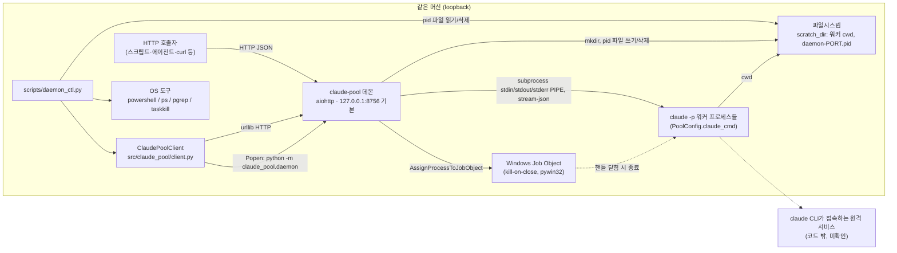

# 08. 시스템 컨텍스트 (as-built)

## 컨텍스트 다이어그램

## 연계 지점

| 외부 대상 | 방향 | 연계 코드 | 접속·설정 참조 |
|---|---|---|---|
| HTTP 호출자 | 호출자 → 데몬 | 라우트 `src/claude_pool/server.py:57-69`, 미들웨어 `server.py:28-48` | 바인딩 `daemon.py:36`(`config.host`, `config.port`), 계약은 [11-api-contract](11-api-contract.md) |
| Python 클라이언트 | 호출자 프로세스 안의 어댑터 | `src/claude_pool/client.py:35-200` | 기본 `host="127.0.0.1"`, `port=8756`(`client.py:38-39`), `base_url = f"http://{host}:{port}"`(`client.py:45`). 클라이언트 쪽 loopback 검증은 없다 |
| 데몬 자동 기동 | 클라이언트 → 새 데몬 프로세스 | `client.py:57-74` | 자식 환경에 `CLAUDE_POOL_HOST`/`CLAUDE_POOL_PORT` 주입(`client.py:60-62`) |
| `claude` CLI | 데몬 → 자식 프로세스 | 스폰 `src/claude_pool/worker.py:48-62`, 입출력 `worker.py:76-121` | argv 앞부분 `PoolConfig.claude_cmd`(`config.py:39`), 모델 `PoolConfig.model`(`worker.py:45`), cwd `scratch_dir`(`worker.py:54`) |
| Windows Job Object | 데몬 → 커널 객체 | `src/claude_pool/winjob.py:20-41`, 생성 `pool.py:25`, 할당 `worker.py:61` | Windows에서만 동작, 그 외 `None`/no-op(`winjob.py:23-24`, `winjob.py:35-36`) |
| 파일시스템 | 데몬·운영 스크립트 | `daemon.py:27`(mkdir), `daemon.py:38`(pid 쓰기), `daemon.py:43`(pid 삭제), `scripts/daemon_ctl.py:24-29`(pid 읽기) | `scratch_dir` 기본 `~/.claude-pool/scratch`(`config.py:36-38`), 파일명 `daemon-{port}.pid`(`daemon.py:23`) |
| OS 프로세스 도구 | 운영 스크립트 → OS | `scripts/daemon_ctl.py:32-44`, `daemon_ctl.py:60-80`, `daemon_ctl.py:91-96` | Windows `powershell Get-CimInstance`/`taskkill`, 그 외 `ps`/`pgrep`/`SIGTERM` |
| 원격 서비스(구독 계정) | `claude` CLI → 원격 | 이 저장소 코드에 연계 코드 없음 | 데몬은 CLI 출력 텍스트로만 결과·오류를 받는다(`errors.py:1-12`). 접속 대상·인증 방식은 `미확인` |

## 경계에 대한 실측 사실

- 데몬이 직접 여는 네트워크 연결은 서버 리슨 소켓뿐이다. 아웃바운드 HTTP·DB·큐 클라이언트 코드는 `src/`에 없다.
- `/docs` HTML은 외부 CDN 리소스를 참조하지 않도록 작성돼 있다(`apidocs.py:328` docstring, `tests/test_apidocs.py:56-64`) → [11-api-contract](11-api-contract.md#자기-문서).
- 조사 스크립트(`scripts/bench_cold_vs_warm.py`, `scripts/investigate_stream_json_timeout.py`)는 데몬을 거치지 않고 `claude` CLI를 직접 스폰한다.
- 외부 의존 패키지 목록은 [02-external-dependencies](02-external-dependencies.md), 신뢰 경계는 [12-security-auth](12-security-auth.md).

## 실측 근거

- 기준 commit: `821f6e9c83edc2b2f11434cc00e52c106f6f7b42`
- 확인한 소스: [server.py](../../../src/claude_pool/server.py), [daemon.py](../../../src/claude_pool/daemon.py), [client.py](../../../src/claude_pool/client.py), [worker.py](../../../src/claude_pool/worker.py), [winjob.py](../../../src/claude_pool/winjob.py), [pool.py](../../../src/claude_pool/pool.py), [config.py](../../../src/claude_pool/config.py), [apidocs.py](../../../src/claude_pool/apidocs.py), [errors.py](../../../src/claude_pool/errors.py), [daemon_ctl.py](../../../scripts/daemon_ctl.py), 조사 스크립트 2개
- 확인 범위: 연계 코드 정적 확인. 실제 프로세스·네트워크 관계를 관찰하지 않았다.
- 미확인: `claude` CLI가 접속하는 원격 서비스와 인증 방식, 실제 호출자 목록.
