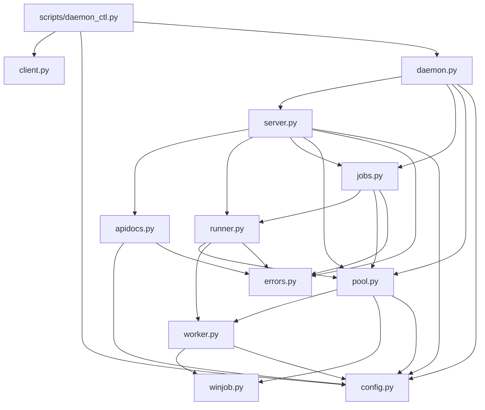

# 09. 컴포넌트 아키텍처 (as-built)

## 모듈 구성

프레임워크 계층 디렉터리(routes/services/repositories)는 없고, `src/claude_pool/` 한 패키지 안의 평면 모듈로 책임이 나뉜다. 저장소 계층은 없다(상태는 메모리).

| 역할 | 모듈 | 주요 심볼 |
|---|---|---|
| 진입·조립 | `daemon.py` | `main`, `run_daemon`, `pid_file`, `_wait_for_shutdown_signal` |
| HTTP 진입부 | `server.py` | `create_app`, `require_loopback_host`, `hostname_from_host_header`, `_read_prompt_request`, `_failure_response`, `handle_*` 9개 |
| 요청 실행 | `runner.py` | `execute`, `Outcome`, `_note` |
| 백그라운드 실행·보관 | `jobs.py` | `Job`, `JobStore` |
| 실패 분류 | `errors.py` | `Failure`, `classify`, `DEFAULT_RETRY_AFTER_SEC` |
| 워커 자원 관리 | `pool.py` | `WorkerPool`, `PoolUnavailableError`, `STOP_DRAIN_TIMEOUT_SEC` |
| 자식 프로세스 어댑터 | `worker.py` | `Worker`, `WorkerError`, `CREATION_FLAGS` |
| OS 어댑터 | `winjob.py` | `create_kill_on_close_job`, `assign_process_to_job` |
| 설정 | `config.py` | `PoolConfig`, `is_loopback_host` |
| 자기 문서 | `apidocs.py` | `api_info`, `openapi_spec`, `render_html`, `FAILURE_KINDS`, `CONSTRAINTS` |
| 원격 클라이언트 | `client.py` | `ClaudePoolClient`, `ClaudePoolError` |

파일 단위 책임은 [01-project-structure](01-project-structure.md#file-responsibility-map).

## 의존 방향 (패키지 내부 import 기준)

| 모듈 | import하는 패키지 내부 모듈 | 근거 |
|---|---|---|
| `daemon.py` | `config`, `jobs`, `pool`, `server` | `daemon.py:10-13` |
| `server.py` | `apidocs`, `config`, `errors`, `jobs`, `pool`, `runner` | `server.py:7-12` |
| `jobs.py` | `errors`, `pool`, `runner` | `jobs.py:19-21` |
| `runner.py` | `errors`, `pool`, `worker` | `runner.py:13-15` |
| `pool.py` | `winjob`, `config`, `worker` | `pool.py:7-9` |
| `worker.py` | `winjob`, `config` | `worker.py:9-10` |
| `apidocs.py` | `config`, `errors` | `apidocs.py:15-16` |
| `config.py`, `errors.py`, `winjob.py`, `client.py`, `__init__.py` | 없음 | 각 파일 import 절 |
| `scripts/daemon_ctl.py` | `client`, `config`, `daemon` | `daemon_ctl.py:17-19` |

- import 순환은 없다(위 표 기준 방향 그래프에 되돌아가는 간선 없음).
- `server.py`에서 `WorkerPool`은 타입 표기에만 쓰이고, `JobStore`는 타입 표기와 `create_app`의 `jobs is None` 분기 생성에 쓰인다(`server.py:54-56`).
- `client.py`는 패키지 내부 모듈을 import하지 않으며 데몬과 HTTP로만 연결된다(`client.py:1-9`).

## 조립 위치

| 조립 | 위치 | 내용 |
|---|---|---|
| 데몬 전체 | `src/claude_pool/daemon.py:26-39` | `WorkerPool(config)` → `JobStore(pool, retention_sec, max_jobs)` → `pool.start()` → `create_app(pool, jobs)` → `AppRunner`/`TCPSite` |
| 앱 | `src/claude_pool/server.py:51-70` | 미들웨어 1개 등록, `app["pool"]`/`app["jobs"]` 주입, 라우트 9개 등록 |
| 풀·워커 | `src/claude_pool/pool.py:25`, `pool.py:85` | 풀당 Job Object 1개를 만들어 모든 `Worker(config, job=...)`에 전달 |
| 종료 | `src/claude_pool/daemon.py:40-51` | 역순 정리 → [10-data-flow](10-data-flow.md#데몬-종료-순서) |

## 책임 경계 (코드에서 확인한 사실)

- HTTP 요청·응답 객체(`web.Request`/`web.Response`)를 다루는 모듈은 `server.py`뿐이다. `runner.py`·`jobs.py`·`pool.py`·`worker.py`는 aiohttp를 import하지 않는다.
- `runner.execute`는 `Outcome`을 돌려주며 HTTP 상태 번호는 `Failure.status` 값으로만 들고 다닌다(`runner.py:18-34`, `errors.py:53-60`).
- 워커 프로세스를 직접 스폰하는 곳은 `WorkerPool._spawn_and_add_idle_locked`(`pool.py:85-86`)뿐이며, 워커 kill 경로는 `release`(`pool.py:190`)·`_acquire`의 죽은 워커 폐기(`pool.py:147`)·`stop`(`pool.py:79`)·축소 루프(`pool.py:220`)·`Worker.run` 타임아웃(`worker.py:89`)이다.
- 반복되는 작성 관용구는 [07-development-patterns](07-development-patterns.md).

## 실측 근거

- 기준 commit: `821f6e9c83edc2b2f11434cc00e52c106f6f7b42`
- 확인한 소스: `src/claude_pool/*.py` 12개 전부(import 절과 조립 코드), [daemon_ctl.py](../../../scripts/daemon_ctl.py)
- 확인 범위: 정적 import 분석. 런타임 동적 import는 `winjob.py:14-17`의 플랫폼 조건부 pywin32 import 외에 없음을 확인했다.
- 미확인: 없음.
