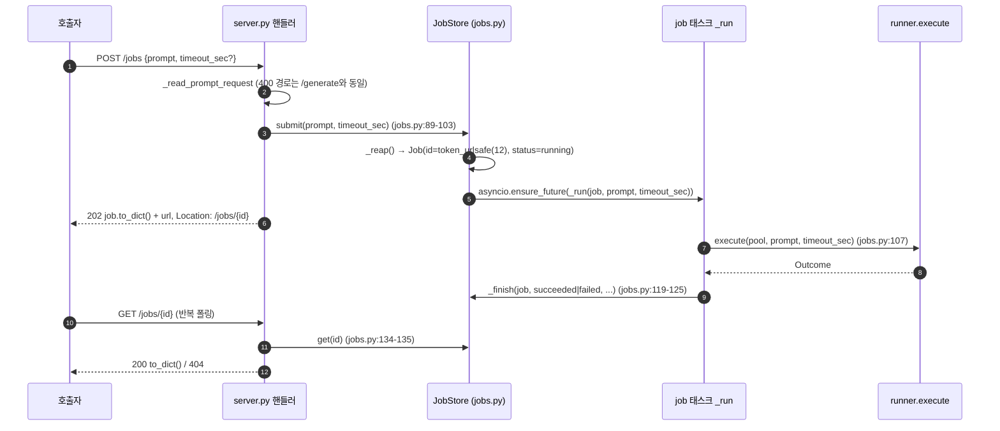
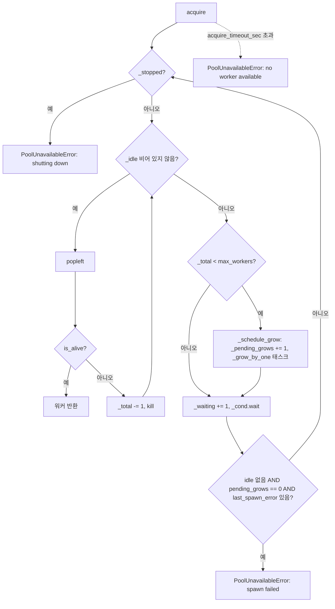
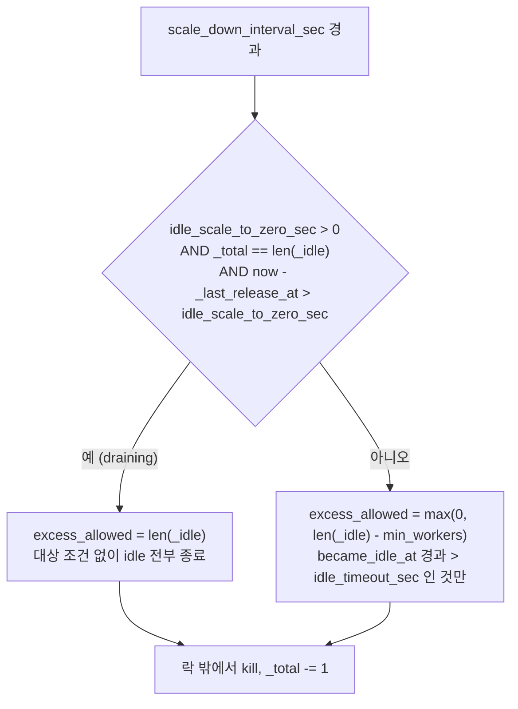
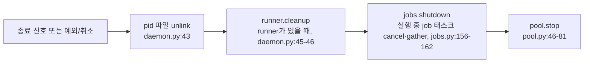

# 10. 데이터 흐름 (as-built)

DB 호출은 없다. 요청 데이터는 메모리 객체(`Job`, `WorkerPool` 상태)와 자식 프로세스 파이프 사이에서만 이동한다.

## 미들웨어 파이프라인

- 등록된 미들웨어는 `require_loopback_host` 1개다(`src/claude_pool/server.py:52`). 모든 라우트가 이것을 먼저 통과한다.
- 순서: aiohttp 라우팅 → `require_loopback_host`(`server.py:28-48`) → 라우트 핸들러. 가드는 `request.host`에서 포트·IPv6 괄호를 떼어(`server.py:15-25`) `is_loopback_host`로 판정하고, 실패하면 핸들러를 호출하지 않고 403을 돌려준다.
- 요청 본문 크기 제한·CORS·압축·인증 미들웨어는 코드에 없다.

## 동기 경로 `POST /generate`

런타임 시퀀스 다이어그램은 [00-overview](00-overview.md#런타임-플로우--요청-1건)에 있다. 단계:

1. `handle_generate`(`server.py:115-124`) → `_read_prompt_request`(`server.py:77-97`): JSON 파싱, object 확인, `prompt` 문자열·비어 있지 않음 확인, `timeout_sec` `float()` 변환(생략 시 `config.default_timeout_sec`).
2. `runner.execute(pool, prompt, timeout_sec)`(`src/claude_pool/runner.py:37-67`).
3. `pool.acquire()`(`src/claude_pool/pool.py:121-167`) — 아래 [워커 획득](#워커-획득).
4. `worker.run(prompt, timeout_sec)`(`src/claude_pool/worker.py:76-121`): `{"type":"user","message":{"role":"user","content":prompt}}` + `\n`을 UTF-8로 stdin에 쓰고 `communicate()`를 `wait_for(timeout)`으로 감싼다. stdout에서 첫 `"type":"result"` JSON 줄의 `result`·`duration_ms`·`is_error`·`subtype`을 꺼낸다.
5. `finally`: `await asyncio.shield(pool.release_in_background(worker))`(`runner.py:57-61`) — 아래 [워커 반납](#워커-반납과-보충). 단 `TimeoutError`·`WorkerError` 분기는 `except` 안의 `return _note(...)` 식이 먼저 평가되므로 분류와 `note_failure` 기록이 이 반납보다 먼저 실행된다(`runner.py:51-56`).
6. 결과가 반환된 경우(반납 뒤): `result["is_error"]`면 결과 텍스트로 `classify`(`runner.py:63-66`), 아니면 `Outcome.ok`. 모든 결과는 `_note`로 `pool.note_success()`/`note_failure(error)`에 기록된다(`runner.py:70-75`).
7. 핸들러가 `Outcome`을 HTTP로 변환: 200 `{text, duration_ms}` 또는 `_failure_response`(`server.py:100-112`).

HTTP 연결은 5단계 완료까지 유지된다. 호출자 연결 끊김 등으로 핸들러 태스크가 취소되면, `finally`의 반납은 shield와 풀의 태스크 추적으로 계속 진행된다(주석 `runner.py:58-60`).

## 백그라운드 경로 `/jobs`

- 전체 프롬프트는 `Job`에 저장하지 않고 태스크 인자로만 전달된다. `Job`에는 앞 80자 `prompt_preview`만 남는다(`jobs.py:32`, `jobs.py:96`, `jobs.py:100`).
- `_run`의 예외 처리(`jobs.py:105-125`): `CancelledError` → `cancelled` 기록 후 재발생, 그 외 예외 → `failed`·`worker_failed`/502 기록, 정상 반환 → `Outcome`에 따라 `succeeded`/`failed`.
- 태스크 완료 콜백이 `_tasks`에서 id를 제거한다(`jobs.py:102`). 종결 job 객체는 `_jobs`에 보관 규칙이 허용하는 동안 남는다.

### 취소 `DELETE /jobs/{id}`

`handle_cancel_job`(`server.py:153-157`) → `JobStore.cancel`(`jobs.py:141-154`):

1. id가 없으면 `None` → 404.
2. 태스크가 끝나지 않았으면 `task.cancel()` 후 `await asyncio.gather(task, return_exceptions=True)`로 태스크 종료까지 기다린다. 태스크 안의 `runner.execute`는 `finally`에서 shield된 반납을 수행하고, `_run`이 `cancelled`를 기록한다.
3. 태스크가 없거나 끝났는데 job이 종결 상태가 아니면 `cancelled`로 기록한다.
4. 이미 종결된 job은 변경하지 않는다. 이 경로에 저장소 삭제 문장은 없다.
5. 200 + 그 시점 `to_dict()`.

### 보관·상한 reap

`_reap()`(`jobs.py:164-183`)은 `submit()`(`jobs.py:90`)과 `list()`(`jobs.py:138`)에서만 호출된다. `get()`, `cancel()`, `stats()`는 reap하지 않는다. 순서: 보관 기간(`retention_sec`) 초과 종결 job 삭제 → 전체 수가 `max_jobs`를 넘으면 종결 job을 `finished_at` 오름차순으로 초과분 삭제(실행 중 job 제외). 수치는 [15-non-functional-requirements](15-non-functional-requirements.md).

## 워커 획득

`WorkerPool.acquire`(`pool.py:126-134`)가 `_acquire`(`pool.py:136-172`)를 `acquire_timeout_sec`로 감싼다. `_acquire`는 `_cond`를 잡고 반복한다.

- `_grow_by_one`(`pool.py:174-183`)은 락 안에서 한도·종료를 재확인한 뒤 `_try_spawn_and_add_idle_locked`로 1개 스폰하고, `finally`에서 `_pending_grows`를 줄인다.
- 스폰(`pool.py:88-95`): `Worker(config, job=self._job)` → `worker.start()`(`worker.py:48-62`: `create_subprocess_exec`, `CREATION_FLAGS`, Job Object 할당, `became_idle_at` 기록) → `_idle` 추가 → `_total += 1` → `_last_spawn_error = None` → `notify()`.

## 워커 반납과 보충

- `release_in_background(worker)`(`pool.py:185-188`)는 `release`를 `_background_tasks`에 추적되는 태스크로 실행한다.
- `release(worker)`(`pool.py:190-204`): 무조건 `worker.kill()` → 락 안에서 `_total -= 1`과 `_last_release_at = time.monotonic()` 기록(`pool.py:198`) → `_total < min_workers`이거나 (`_waiting > 0` 그리고 `_total < max_workers`)이고 종료 중이 아니면 `_try_spawn_and_add_idle_locked`로 1개 보충. 워커는 idle로 되돌아가지 않는다.
- 유휴 판정의 기준 시각은 acquire가 아니라 이 반납 시각이다. 주석(`pool.py:36-39`)은 오래 걸리는 요청이 실행 중인 동안 유휴로 보이면 안 되기 때문이라고 적는다. 초기값은 `WorkerPool.__init__`에서 `time.monotonic()`이다(`pool.py:40`).

## idle 축소

`_scale_down_loop`(`pool.py:206-240`)는 `scale_down_interval_sec`마다 깨어나 락 안에서 종료 대상 수(`excess_allowed`)와 대상 판정을 정한 뒤, 락 밖에서 워커마다 kill하고 다시 락을 잡아 `_total -= 1`한다(`pool.py:235-240`). 규칙은 두 갈래다.

| 갈래 | 조건 | 하한 | 대상 선별 |
|---|---|---|---|
| 유휴 축소(드레인) | `idle_scale_to_zero_sec > 0`이고, 배포된 워커가 없고(`_total == len(_idle)`), 마지막 반납 이후 경과가 기준 시간 초과 (`pool.py:216-220`) | 없음(0까지) | `idle_timeout_sec`를 보지 않고 `_idle` 전부 (`pool.py:221-231`) |
| 초과분 축소 | 그 밖의 경우 | `min_workers` | `became_idle_at` 경과가 `idle_timeout_sec` 초과인 것만 (`pool.py:223`, `pool.py:229`) |

- `_total == len(_idle)` 조건 때문에 대여 중 워커가 하나라도 있으면 드레인이 발동하지 않는다. `/generate`와 `/jobs`가 같은 `runner.execute`를 거쳐 워커를 빌리므로, 실행 중 백그라운드 job도 이 조건에 걸린다(주석 `pool.py:214-215`).
- `became_idle_at`은 `Worker.start()`에서만 기록된다(`worker.py:62`).

### 드레인 이후

1. 축소 후 풀은 `_total == 0`, `_idle == 0`이다. 데몬·포트·`JobStore`는 그대로다.
2. 다음 요청의 `acquire`는 idle이 없으므로 `_schedule_grow()`로 온디맨드 스폰을 예약하고 `_cond`에서 기다린다(`pool.py:154-155`, `pool.py:157-159`).
3. 그 요청이 끝나고 `release`가 돌면 `_total(0) < min_workers`이므로 1개를 보충한다(`pool.py:199-204`). 즉 재예열은 반납 1회당 1개씩이며, `start()`의 일괄 예열(`pool.py:45-49`)은 기동 때만 돈다.
4. `idle_scale_to_zero_sec`가 `0` 이하이면 `draining`이 항상 거짓이라 기존 초과분 축소만 남는다(`pool.py:217`).

## 데몬 기동 순서

`run_daemon`(`src/claude_pool/daemon.py:26-39`):

1. `config.scratch_dir.mkdir(parents=True, exist_ok=True)`
2. `WorkerPool(config)`(이때 Job Object 생성), `JobStore(pool, ...)`
3. `await pool.start()` — `min_workers`개를 순차 스폰하고 축소 루프 시작(`pool.py:40-44`)
4. `create_app(pool, jobs)` → `AppRunner.setup()` → `TCPSite(host, port).start()`
5. pid 파일에 `os.getpid()` 기록
6. `_wait_for_shutdown_signal()`

## 데몬 종료 순서

`run_daemon`의 `finally`(`daemon.py:40-51`):

- `jobs.shutdown()`과 `pool.stop()`은 중첩 `finally`에 있어 `runner.cleanup()`이 예외를 내도 실행된다(`daemon.py:44-51`). 주석(`daemon.py:48-49`): job을 먼저 취소해야 워커가 풀로 반납되고 그 다음 `pool.stop()`이 정리한다.
- `pool.stop()`(`pool.py:46-81`): `_stopped = True` → 축소 루프 태스크 cancel → `_background_tasks`(증가·반납)를 최대 `STOP_DRAIN_TIMEOUT_SEC`(5.0초) 기다린 뒤 남은 태스크 cancel·gather → 락 안에서 idle 목록을 비우고 `notify_all()` → idle 워커마다 kill 후 `_total -= 1`. 대여 중 워커는 건드리지 않고 각 `release()`에 맡긴다(docstring `pool.py:47-51`).
- Python `finally`가 실행되지 않는 종료에서는 Job Object의 kill-on-close가 워커 정리 수단으로 설계돼 있다(`winjob.py:1-9`, `worker.py:57-60`).

## 실측 근거

절마다 기준 시점이 다르다.

### 이번 갱신 기준 — `7cc905fc828abeb790f3e8d46de469e7021ed137`

- 갱신한 절: 「워커 획득」·「워커 반납과 보충」의 `pool.py` 줄 번호와 `_last_release_at` 기록, 「idle 축소」 전체(두 갈래 규칙 표·흐름도·「드레인 이후」).
- 확인한 소스: [pool.py](../../../src/claude_pool/pool.py)(전체), [worker.py](../../../src/claude_pool/worker.py)(`start`의 `became_idle_at`)
- 확인 범위: 제어 흐름 정적 추적. 축소 루프를 실행해 타이밍을 관찰하지 않았다.

### 이전 기준 — `821f6e9c83edc2b2f11434cc00e52c106f6f7b42`

- 위에 적지 않은 나머지 절(「미들웨어 파이프라인」·「동기 경로」·「백그라운드 경로」·「데몬 기동 순서」·「데몬 종료 순서」)은 이 commit 기준이며 이번에 다시 확인하지 않았다.
- 당시 확인한 소스: [server.py](../../../src/claude_pool/server.py), [runner.py](../../../src/claude_pool/runner.py), [jobs.py](../../../src/claude_pool/jobs.py), [pool.py](../../../src/claude_pool/pool.py), [worker.py](../../../src/claude_pool/worker.py), [winjob.py](../../../src/claude_pool/winjob.py), [daemon.py](../../../src/claude_pool/daemon.py)
- 미확인: aiohttp가 클라이언트 연결 끊김 시 핸들러 태스크를 취소하는 조건(프레임워크 버전·설정 의존), 신호 미지원 플랫폼에서 종료 시 `finally`가 실행되는 범위, 드레인 발동·재예열의 실제 타이밍.
