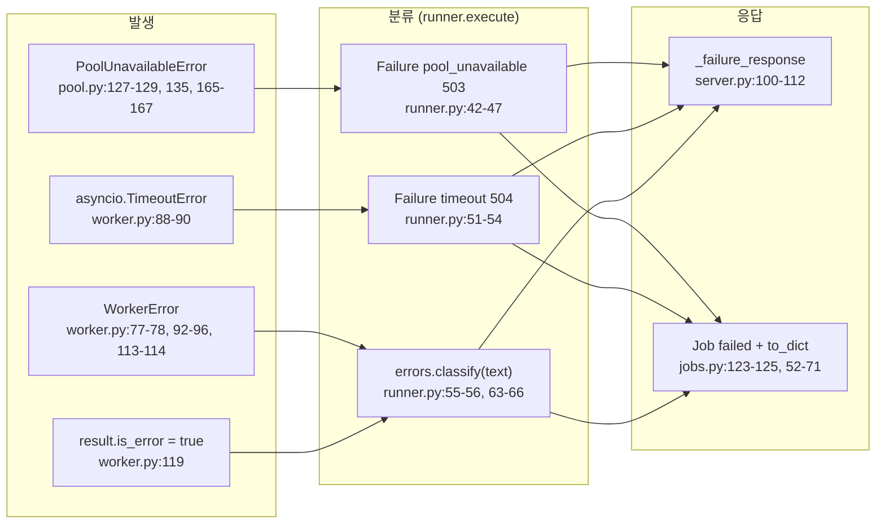

# 13. 에러 정책 (as-built)

## 예외 발생 → 분류 → 응답 경로

## 실패 kind 매핑

| kind | HTTP | retryable | `retry_after_sec` | 결정 위치 | 발생 조건 |
|---|---|---|---|---|---|
| `pool_unavailable` | 503 | true | 없음 | `src/claude_pool/runner.py:42-47` (하드코딩) | `pool.acquire()`가 `PoolUnavailableError`: 획득 타임아웃, 종료 중, 스폰 실패 |
| `timeout` | 504 | true | 없음 | `runner.py:51-54` (하드코딩) | `worker.run()`이 `asyncio.TimeoutError`, `error="worker timed out"` |
| `rate_limited` | 429 | true | 메시지의 대기 힌트 정수, 없으면 `DEFAULT_RETRY_AFTER_SEC = 60` | `src/claude_pool/errors.py:76-84` | 텍스트가 rate limit 패턴(`errors.py:22-31`)에 일치 |
| `not_authenticated` | 503 | false | 없음 | `errors.py:86-89` | rate limit 불일치 + 인증 패턴(`errors.py:33-44`) 일치 |
| `worker_failed` | 502 | false | 없음 | `errors.py:91`; job 태스크 예기치 않은 예외 `jobs.py:111-118` | 위 패턴 불일치(빈 텍스트 포함), 또는 job 실행 중 예외 |
| `forbidden_host` | 403 | false | 없음 | `src/claude_pool/server.py:39-47` (미들웨어) | Host 헤더가 loopback 리터럴이 아님 |

- `classify(text)`(`errors.py:72-91`): `text or ""`로 정규화 후 대소문자 무시 `re.search`. rate limit 패턴을 인증 패턴보다 먼저 검사한다. 예외를 던지지 않는다(docstring `errors.py:73`).
- 대기 힌트 정규식: `(?:try again in|retry after|wait)\s+(\d+)\s*(?:s\b|sec|second)`(`errors.py:48-50`).
- `classify` 입력 텍스트: `WorkerError`의 문자열(비정상 종료 시 exit code와 stderr 포함, `worker.py:93-96`) 또는 `is_error` 결과의 `result` 텍스트(`runner.py:63-66`, 이때 결과의 `duration_ms`를 유지).

## HTTP 비실행 오류

| 상황 | 상태 | 본문 | 위치 |
|---|---|---|---|
| 요청 본문 오류 (`BadRequest`) | 400 | `{"error"}` | 발생 `server.py:77-97`, 변환 `server.py:118-119`, `server.py:130-131` |
| 존재하지 않는 job | 404 | `{"error": "no such job"}` | `server.py:141-142`, `server.py:155-156` |

- 400·404 본문에는 `kind`·`retryable`이 없다.
- 400은 `runner.execute`에 도달하지 않으므로 `/health`의 `last_error`를 바꾸지 않는다.
- 핸들러 안의 그 밖의 예외(예: 위 경로 밖의 예기치 않은 예외)를 JSON으로 바꾸는 전역 예외 처리기·에러 미들웨어는 없다. 그런 예외의 응답 형식은 aiohttp 기본 동작에 따르며 `미확인`이다.

## 응답 구현 위치

| 경로 | 구현 | 형식 |
|---|---|---|
| 동기 실패 | `_failure_response(outcome)` `server.py:100-112` | status = `failure.status`, 본문 `{error, kind, retryable}` + `duration_ms`(0이 아닐 때), `Retry-After: str(retry_after_sec)`(None이 아닐 때) |
| 백그라운드 실패 | `JobStore._finish` `jobs.py:127-132` → `Job.to_dict()` `jobs.py:63-70` | job 조회는 200. 본문 `error`, `kind`(failure 없으면 `"worker_failed"`), `retryable`, `retry_after_sec`(있을 때), `duration_ms`(0이 아닐 때) |
| 취소된 job | `jobs.py:108-110`, `jobs.py:152-153` | 내부 `error="cancelled"` 기록, `to_dict()`는 `cancelled`에 추가 키를 넣지 않음 |
| 클라이언트 측 변환 | `ClaudePoolError` `src/claude_pool/client.py:176-193` | HTTP 오류 본문의 `error`/`kind`(없으면 `"unknown"`)/`retryable`, `retry_after_sec`은 본문 우선·숫자 `Retry-After` 헤더 폴백. JSON이 아닌 본문은 `"HTTP {code}"`. `HTTPError`가 아닌 전송 예외는 변환하지 않는다(`client.py:97-101`) |
| 클라이언트 `wait()` | `client.py:161-173` | job `failed`는 본문의 `error`·`kind`·`retryable`·`retry_after_sec`로, `cancelled`는 본문에 분류 키가 없어 `kind`·메시지가 상태 문자열(`"cancelled"`)인 `ClaudePoolError`로, 자체 대기 초과는 `kind="timeout"`, `retryable=True` |

## 재시도·타임아웃·부분 실패

- 데몬은 재시도하지 않는다: `execute`는 획득 1회·실행 1회이며 루프가 없다(`runner.py:37-67`). 재시도 판단 정보는 `retryable`·`Retry-After`로만 전달한다.
- 클라이언트도 자동 재시도하지 않는다(`client.py`에 재시도 루프 없음). `wait()`의 폴링은 job 상태 조회 반복이다.
- 워커 타임아웃 시 워커를 kill하고 예외를 다시 올린다(`worker.py:88-90`). 이후 반납에서 한 번 더 kill을 호출하며 `kill()`은 이미 종료된 프로세스에 no-op이다(`worker.py:123-126`).
- 반납 중 보충 스폰 실패는 삼켜 `last_spawn_error`에만 기록한다(`pool.py:92-104`, `pool.py:196-198` 주석: 이미 계산된 응답을 500으로 바꾸지 않기 위함).

## `apidocs.FAILURE_KINDS`와의 관계

- `FAILURE_KINDS`(`src/claude_pool/apidocs.py:31-45`)는 위 6개 kind의 `kind`·`status`·`retryable`·`meaning`을 **별도로 적은 문서용 목록**이다. `errors.classify`나 `runner`에서 import해 생성하지 않는다. 공유하는 값은 `DEFAULT_RETRY_AFTER_SEC`(`apidocs.py:16`, `apidocs.py:35-36`) 하나다.
- 사용처: `GET /`의 `failure_kinds`(`apidocs.py:111`), OpenAPI 오류 스키마 `kind` enum(`apidocs.py:126`)과 `/generate` 응답 상태 목록(`apidocs.py:156-163`), `/docs` 실패 표(`apidocs.py:311-324`).
- 일치 확인 테스트: `tests/test_apidocs.py:95-109`가 `rate_limited`·`not_authenticated`·`worker_failed` 세 kind에 대해 `classify` 결과의 `status`·`retryable`을 `FAILURE_KINDS`와 대조하고, `tests/test_apidocs.py:112-114`가 kind 중복 없음을 확인한다. `pool_unavailable`·`timeout`(runner 하드코딩)과 `forbidden_host`(미들웨어)는 이 대조 테스트의 입력에 포함되지 않는다.

## 실측 근거

- 기준 commit: `821f6e9c83edc2b2f11434cc00e52c106f6f7b42`
- 확인한 소스: [errors.py](../../../src/claude_pool/errors.py), [runner.py](../../../src/claude_pool/runner.py), [server.py](../../../src/claude_pool/server.py), [jobs.py](../../../src/claude_pool/jobs.py), [worker.py](../../../src/claude_pool/worker.py), [pool.py](../../../src/claude_pool/pool.py), [apidocs.py](../../../src/claude_pool/apidocs.py), [client.py](../../../src/claude_pool/client.py), [test_errors.py](../../../tests/test_errors.py), [test_apidocs.py](../../../tests/test_apidocs.py)
- 확인 범위: 예외 발생·포착·변환 지점 정적 추적. 실제 `claude` CLI의 오류 문구와 패턴의 일치 여부는 확인하지 않았다.
- 미확인: 실제 CLI가 내는 rate limit·로그인 만료 메시지 문구, 처리되지 않은 핸들러 예외에 대한 aiohttp 기본 응답 형식.
