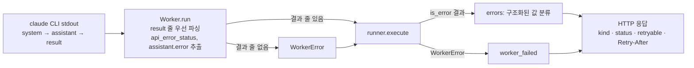

# 00. 개요 (design)

- 근거 spec: [구조화된 값으로 워커 실패 분류하기](../../spec/2026-09-17-spec-structured-failure-classification/2026-09-17-spec-structured-failure-classification.md)
- 적용 영역: 워커 실패의 분류 경로(`worker.py` → `runner.py` → `errors.py` → HTTP 응답). 그 밖의 시스템 경계·책임은 현재 구조를 유지한다([as-built/00-overview](../as-built/00-overview.md)).

## 시스템 경계

기본값 적용: 승인 spec의 목적·범위를 경계로 삼는다. 외부 연계는 기존과 같다. 호출자는 HTTP로, `claude` CLI는 stream-json 자식 프로세스로 연결된다. 이번 변경은 CLI stdout에서 읽는 값을 늘릴 뿐 새 외부 연계를 추가하지 않는다.

## 목표 흐름 (실패 분류)

상세 분류 규칙과 경계는 [13-error-policy](13-error-policy.md)에 있다.
